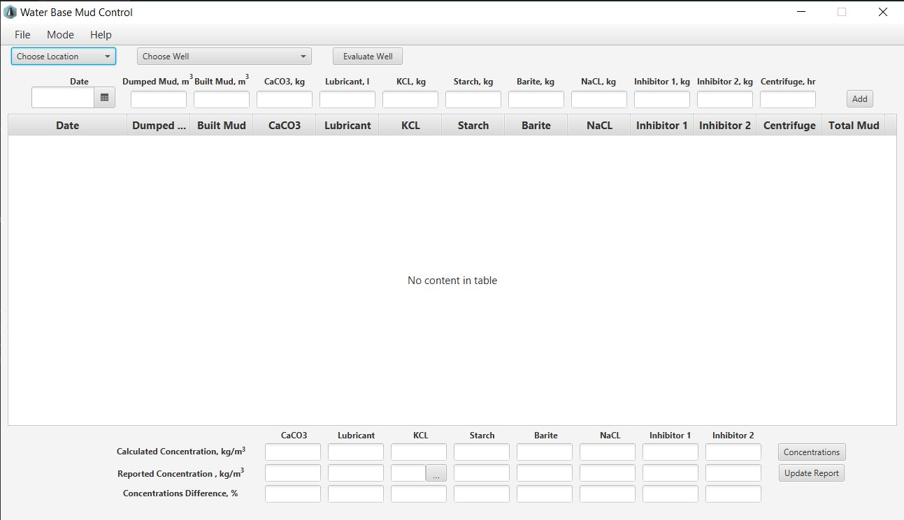
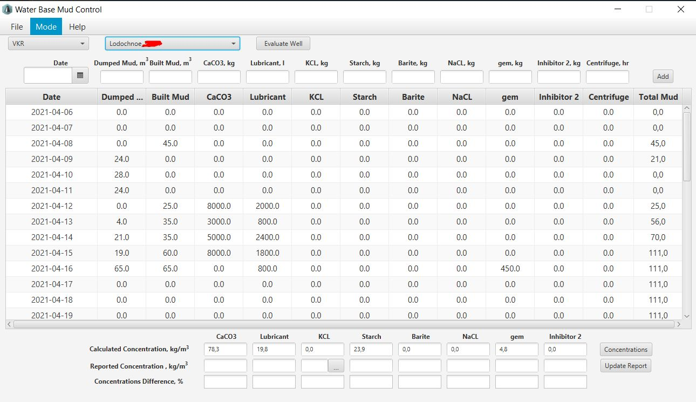
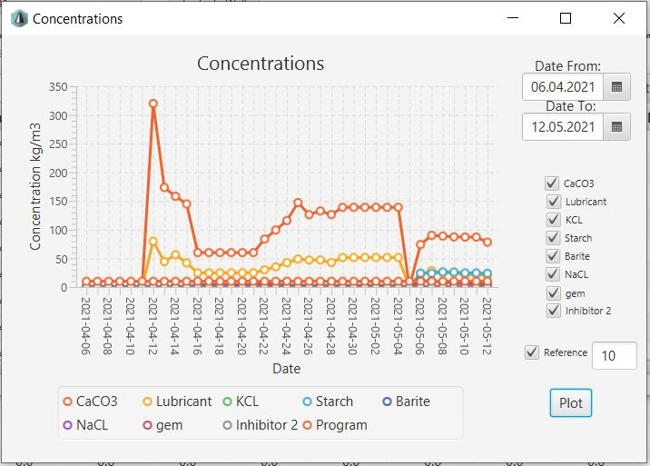
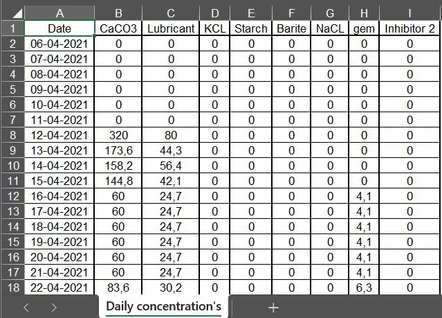
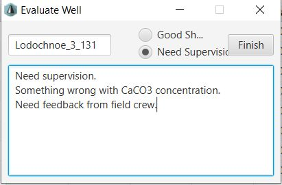
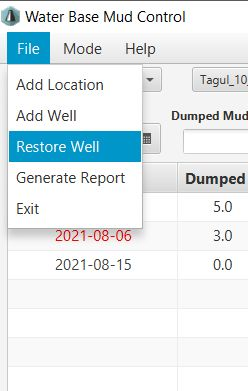
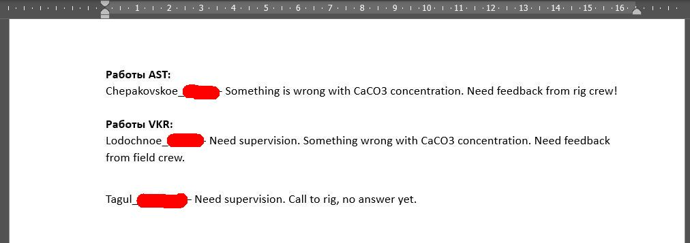

# Проект Mud Control

## Описание

Проект создан для унификации и облегчения рутинной проверки и выявления проблем в отчетах по буровым растворам с различных буровых установок.

### Технологии

- Java 
- JavaFx
- SQLite

## Установка

Запустить приложение из скачанной папки в репозитории в IDE.

## Работа в приложении

Для работы приложения необходимо на диске "С:/" иметь папку "MudControlData" с 2-я файлвми (заготовка папки и файлов лежит в репозитории в соответсвующей папке).

Основной экран приложения:

 
  

В меню "File" есть возможность добавления локации("Add Location") и уже в локации можно создавать новые скважины("Add Well").

Далее в соответствующих выпадающих списках ("Choose Location" и "Choose Well") можно выбрать добавленные данные и далее работать с ними (добавлять данные по растворам за соответствующие даты).

Пример скважины с данными по раствору за какой-то промежуток времени:

 
  

Так в каждой скважине можно вести историю по раствору за весь период строительства. 

На каждом этапе можно оценить и справнить расчетные концентрации реагентов с передаваемыми данными с буровой (строки "Calculated Concentration", "Reported Concentration", "Concentration Difference").

Так же можно выгружать данные, непосредственно по концентрациям за каждый день (кнопка "Concentrations" в нижней-правой части).

Можно просматривать в виде графиков:

 
  

Так же доступна выгрузка в Excel:

 
  

После оценки состояния раствора на скважине есть возможность оставить заключение по скважине (кнопка "Evaluate Well" справа от названия скважины).
После проверки всех рапортов за день, и оставления всех заключений можно сгенерировать итоговый рапорт за день в формате Word ("File" -> "Generate Report"):

  
  

Вид итогового рапорта:

 
  

## Работа со скважинами

Для того чтобы держать в рабочей базе только активные скважины, после окончания скважины данные по ней можно заархивировать. Для этого необходимо вызвать правым кликом по названию скважины меню, и в нем выбрать "Archive Well".
В случае, если эти данные понадобяться позже по пути "File"->"Restore Well" можно скважину восстановить.

Приятной и безаварийной Вам работы!
